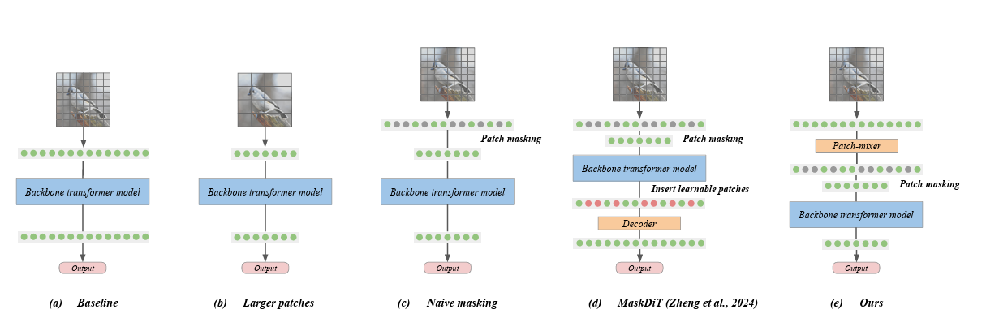
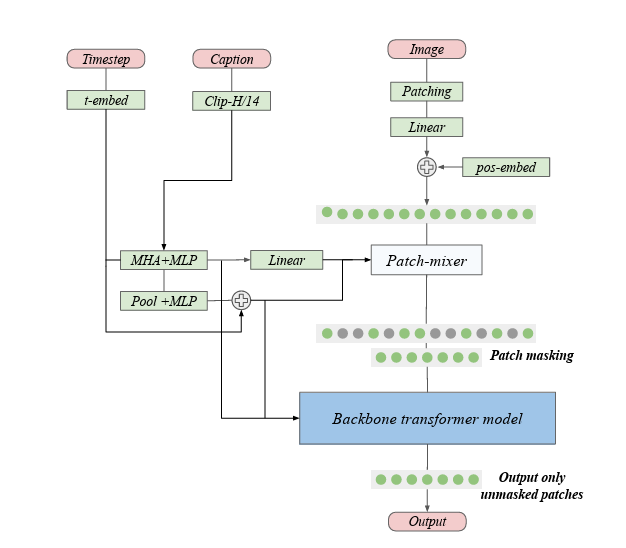

# Diffusion Training from Scratch on a Micro-Budget
official code: [link](https://github.com/SonyResearch/micro_diffusion)

official paper: [link](https://arxiv.org/abs/2407.15811)

<figure style="text-align: center;">
  
  Prompt: <em>Patch sequence to reduce computational cost.</em> 
</figure>

<figure style="text-align: center;">
  
  Prompt: <em>Overall architecture of our diffusion transformer</em> 
</figure>

